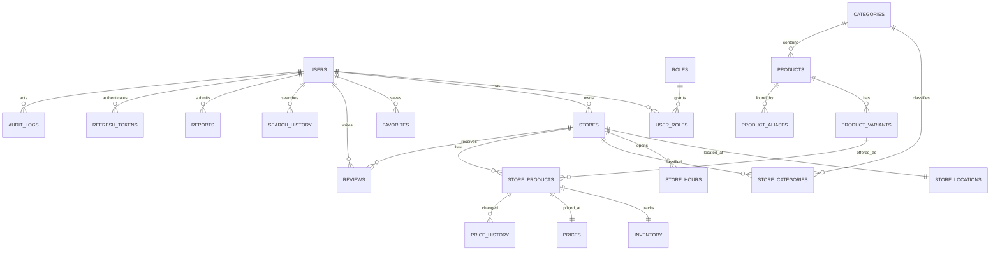

# Database design

## ER model

## Table plan

All domain tables use UUID primary keys plus `created_at` and `updated_at` (`timestamptz`). Mutable aggregates use an integer `version` for optimistic locking. Important lifecycle records use `status`/`deleted_at`; operational history and audit rows are append-only.

| Table | Key constraints and notes |
|---|---|
| `users` | unique normalized email/phone; password hash; status; no hard delete while referenced |
| `roles`, `user_roles` | unique role name; unique `(user_id, role_id)` |
| `stores` | owner FK; unique slug; approval/status; rating aggregates |
| `store_locations` | unique store FK; validated latitude/longitude; address fields |
| `store_hours` | unique `(store_id, weekday)`; local opening/closing times and timezone |
| `categories`, `store_categories` | unique slug; unique store/category pair |
| `products` | normalized name, brand, category FK, status |
| `product_aliases` | normalized alias; unique `(product_id, alias)` |
| `product_variants` | product FK; label, amount/unit, optional unique barcode |
| `store_products` | unique `(store_id, product_variant_id)`; listing status |
| `inventory` | unique store-product FK; nonnegative quantity; enum state; source; updated_by; `observed_at` |
| `prices` | unique store-product FK; positive amount; 3-letter currency |
| `price_history` | store-product FK; old/new amount and currency; changed_by/time |
| `favorites` | user FK; exactly one product or store target; unique target per user |
| `reviews` | unique `(user_id, store_id)`; rating 1–5; moderation status |
| `search_history` | user FK; normalized query; no precise coordinates; retention policy |
| `reports` | reporter, type, optional store/product targets, workflow status |
| `refresh_tokens` | user FK; unique token hash, expiry, revoked/replaced metadata |
| `audit_logs` | actor, action, target type/id, safe JSON metadata, timestamp |

## Core indexes

- GIN trigram indexes on normalized product name and aliases (enable `pg_trgm` in migration)
- B-tree on `products(category_id, status)` and `store_products(product_variant_id, status)`
- B-tree on `inventory(availability, observed_at)` and `prices(amount, currency)`
- B-tree on store latitude/longitude for MVP bounding-box prefilter, followed by Haversine exact filtering
- B-tree on reviews `(store_id, moderation_status, created_at desc)`
- B-tree on favorites `(user_id, target_type)` and audit logs `(target_type, target_id, created_at desc)`

## Consistency

- Inventory/price writes require store ownership and expected `version`; stale writes return `409`.
- A price update locks the current price row, appends history, and updates current price in one transaction.
- Products/stores/users are suspended or soft-deleted; join/history/audit records are retained.
- Search excludes suspended/deleted/unapproved stores and inactive products before ranking.

## Migration sequence

1. `V1`: PostgreSQL extensions
2. `V2–V3`: users, roles, refresh tokens, and type alignment
3. Categories, products, aliases, variants
4. Stores, locations, hours, categories
5. Store products, inventory, prices, price history
6. Favorites, reviews, search history, reports
7. Audit/analytics events, indexes, seed profile
